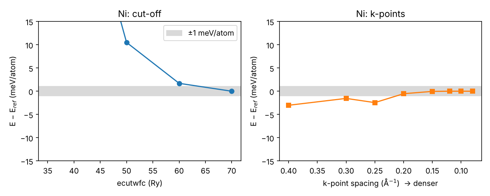
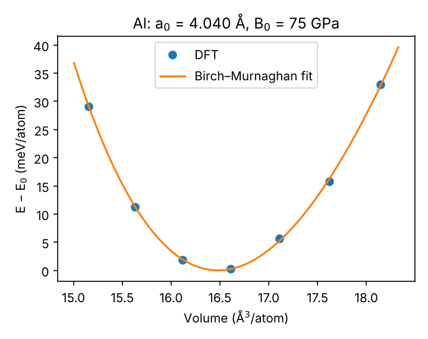

# 01 · DFT fundamentals with Quantum ESPRESSO (`dftlab`)

Learn plane-wave density-functional theory by doing it properly on three materials that
matter for high-temperature structural alloys: **fcc Al**, **ferromagnetic fcc Ni** and the
ordered intermetallic **B2 NiAl**. Everything runs with the free Quantum ESPRESSO code,
driven from Python through ASE, and every number in the results table below was computed
by these scripts.

## 1. The theory in one page

The Kohn–Sham equations replace the interacting many-electron problem by non-interacting
electrons moving in an effective potential that depends on the electron density n(r):

$$\Big[-\tfrac{\hbar^2}{2m}\nabla^2 + V_{ext}(\mathbf r) + V_H[n](\mathbf r) + V_{xc}[n](\mathbf r)\Big]\psi_i = \varepsilon_i\psi_i,\qquad n(\mathbf r)=\sum_i f_i|\psi_i(\mathbf r)|^2$$

* **Exchange–correlation:** PBE (generalised-gradient approximation) — the standard for
  metals and alloys.
* **Plane waves + pseudopotentials:** ψ is expanded in plane waves up to a kinetic-energy
  cut-off `ecutwfc`; core electrons are replaced by ultrasoft pseudopotentials (generated
  here from the pslibrary recipes, inputs in `pseudo/`).
* **k-points:** Brillouin-zone integrals on a Monkhorst–Pack grid; metals need dense grids
  plus **smearing** (Marzari–Vanderbilt, 0.02 Ry) of the Fermi surface.
* **Self-consistency:** n → V_eff → ψ → n until the energy changes by < 10⁻⁹ Ry.

## 2. Contents

| Path | What |
|---|---|
| `inputs/01_al_scf.in`, `02_ni_scf_spin.in`, `03_nial_b2_vcrelax.in` | hand-written pw.x inputs, every keyword commented — run these first |
| `dftlab/` | small library: calculator factory, structures, convergence, Birch–Murnaghan EOS, cubic elastic constants |
| `scripts/01_convergence.py` | cut-off and k-point convergence |
| `scripts/02_eos.py` | equation of state → a₀, B₀, B₀′ (and magnetic moment for Ni) |
| `scripts/03_elastic.py` | C11, C12, C44 from volume-conserving strains; Pugh ratio, Cauchy pressure, Zener anisotropy, Debye temperature |
| `scripts/04_formation_enthalpy.py` | ΔH_f of NiAl at a common cut-off |
| `scripts/05_summary.py` | results table vs experiment → `results/SUMMARY.md` |
| `hpc/slurm_qe.sh` | SLURM template for cluster runs |
| `tools/env.sh` | sets the pw.x command (MPI) and applies the Ubuntu 24.04 QE 6.7 fix |

## 3. Run it

```bash
source tools/env.sh 4            # 4 MPI processes
bash run_all.sh 4                # convergence -> EOS -> elastic -> formation enthalpy -> summary
# or step by step, e.g.
python scripts/02_eos.py --system NiAl
python scripts/03_elastic.py --system NiAl
# quick workflow test without DFT (EMT toy potential, seconds):
python scripts/02_eos.py --system Ni --calc emt
```

## 4. Convergence

| | Al | Ni | NiAl |
|---|---|---|---|
| ecutwfc (Ry) for ≈1 meV/atom | 35 | 60 | 60 |
| k-point spacing (Å⁻¹) | 0.12 | 0.15 | 0.15 |

Al (nearly-free-electron metal) converges slowly with k-points; Ni needs a high cut-off
because its 3d orbitals are localised. 

## 5. Results

Computed with PBE, ultrasoft pseudopotentials, the converged settings above. The full table
(with Ni and B2 NiAl) is regenerated by `scripts/05_summary.py` in
[`results/SUMMARY.md`](results/SUMMARY.md).

| | a₀ (Å) | B (GPa) | C11 | C12 | C44 | θ_D (K) |
|---|---|---|---|---|---|---|
| **Al, DFT (this work)** | 4.040 | 74.9 | 101.6 | 61.5 | 23.4 | 375 |
| Al, experiment | 4.05 | 76 | 108 (114 at 0 K) | 62 | 28 (32 at 0 K) | 428 |

Elastic constants in GPa (stress–strain route; the energy–strain route gives 101.2 / 61.7 / 21.4).
The lattice parameter and bulk modulus agree with experiment within 1–2 %. C44 of Al is
the most sensitive quantity here: it comes from energy differences of ~0.1 meV/atom and
depends on smearing and k-point density. A check at one strain
([`results/Al/c44_convergence.json`](results/Al/c44_convergence.json)) shows it rising
from **23.4 GPa** (k-spacing 0.12 Å⁻¹, 0.02 Ry smearing) to **26.9 GPa** (0.08 Å⁻¹,
0.01 Ry), towards the experimental 28–32 GPa — a textbook example of why a property
must be converged *for itself*, not just the total energy.



## 6. Why these numbers matter for creep

* **B2 NiAl**: Pugh ratio B/G and Cauchy pressure quantify the directional Ni–Al bonding
  behind its brittleness at room temperature; the strongly negative formation enthalpy
  explains its high melting point and slow diffusion — the reason B2 aluminides are
  candidate high-temperature materials.
* **Elastic constants** give E(T→0) and G for modulus-compensated creep analysis
  (σ/E, project 03) and the shear modulus needed in deformation-mechanism maps (project 04).
* **Debye temperature** sets the attempt frequency used for vacancy diffusion (project 02).

## 7. Exercises

1. Repeat the EOS for NiAl with LDA (`input_dft='pz'`, needs LDA pseudopotentials) and
   compare a₀ with PBE — which functional over-binds?
2. Compute non-magnetic Ni (`nspin=1`) and the magnetic energy E_NM − E_FM.
3. Compute the DOS of NiAl (`calculation='nscf'`, then `dos.x`) and find the pseudogap.
4. Add B2 CoAl (needs a Co pseudopotential from pslibrary) and compare with NiAl.

## References

* P. Giannozzi et al., *J. Phys.: Condens. Matter* 21 (2009) 395502; 29 (2017) 465901 — Quantum ESPRESSO.
* J.P. Perdew, K. Burke & M. Ernzerhof, *Phys. Rev. Lett.* 77 (1996) 3865 — PBE.
* A. Dal Corso, *Comput. Mater. Sci.* 95 (2014) 337 — pslibrary.
* M.J. Mehl, *Phys. Rev. B* 47 (1993) 2493 — elastic constants from total energies.
* F. Birch, *Phys. Rev.* 71 (1947) 809 — equation of state.
* A.H. Larsen et al., *J. Phys.: Condens. Matter* 29 (2017) 273002 — ASE.
