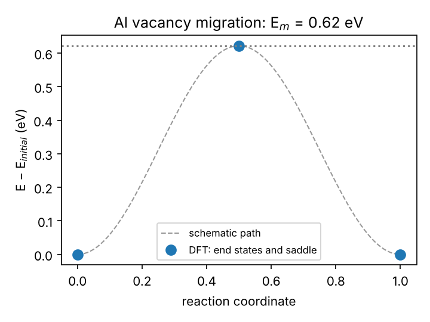
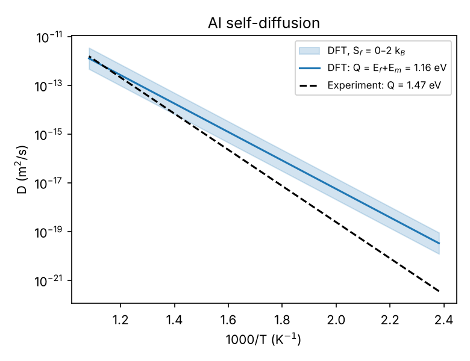
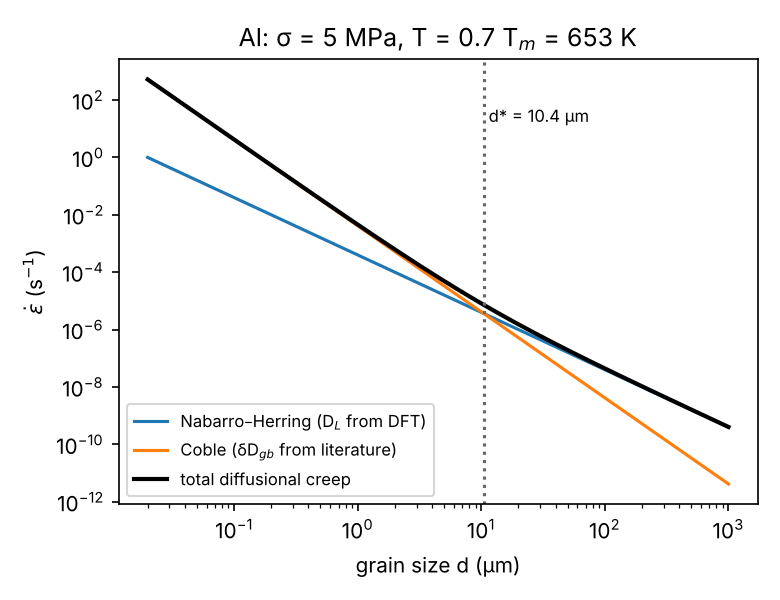

# 02 · From vacancies to diffusional creep with DFT (`vacdiff`)

Diffusion-controlled creep (Nabarro–Herring, Coble, and the climb step of dislocation
creep) is limited by how fast vacancies form and move. This project computes those two
energies from first principles and carries them all the way to a creep rate.

$$E_f^v = E_{N-1}^{relaxed} - \tfrac{N-1}{N}E_N,\qquad E_m = E_{saddle}-E_{initial}\ \text{(CI-NEB)}$$

$$D = f\,a^2\,\nu\,e^{S_f/k}\,\exp\!\left(-\frac{E_f+E_m}{kT}\right)\qquad (f = 0.7815\ \text{for fcc})$$

$$\dot\varepsilon_{NH}=14\frac{\Omega D_L\sigma}{kTd^2},\qquad \dot\varepsilon_{Coble}=\frac{150}{\pi}\frac{\Omega\,\delta D_{gb}\,\sigma}{kTd^3}$$

## Workflow

1. `scripts/01_vacancy_formation.py` — 2×2×2 fcc supercell (32 sites) at the **DFT** lattice
   parameter from project 01; unrelaxed and relaxed vacancy formation energy.
2. `scripts/02_vacancy_migration_neb.py` — migration barrier E_m by two methods:
   * `--method midpoint` (default): the jumping atom is fixed half-way along the jump and all
     other atoms are relaxed. For the symmetric nearest-neighbour jump in a pure fcc metal
     the saddle lies exactly there, so one relaxation gives E_m.
   * `--method neb`: climbing-image NEB (ASE, IDPP initial path) between relaxed end
     states — the general method, needed for asymmetric paths (B2 compounds, solute–vacancy
     pairs, concentrated alloys) but one DFT calculation per image per optimiser step.
   A unit test checks that both give the same barrier (1.164 eV for EMT Ni).
3. `scripts/03_diffusion_and_creep.py` — D(T) with the attempt frequency ν = kθ_D/h (θ_D
   from the DFT elastic constants of project 01), comparison with tracer-diffusion
   experiments, Nabarro–Herring and Coble rates vs grain size and the crossover grain size.

```bash
bash run_all.sh 4 Al            # DFT (needs project 01 results)
python scripts/01_vacancy_formation.py --element Ni --calc emt   # seconds, toy potential
```

## Results (Al, PBE)

2×2×2 fcc supercell (32 sites), 35 Ry, Γ-centred 4×4×4 k-mesh, DFT lattice parameter
4.040 Å (`results/Al_2x2x2/`):

| Quantity | This tutorial (4×4×4) | Dense-k check (6×6×6) | Experiment |
|---|---|---|---|
| E_f unrelaxed (eV) | 0.612 | 0.712 | – |
| E_f relaxed (eV) | **0.536** | **0.635** (est.) | 0.67 |
| relaxation energy (eV) | −0.077 | (reused) | – |
| E_m, constrained midpoint (eV) | **0.622** | – | ≈ 0.6 |
| Q = E_f + E_m (eV) | 1.16 | ≈ 1.26 | 1.28–1.47 |
| D at 0.8 T_m (m²/s) | 4.1 × 10⁻¹⁴ | – | 2.0 × 10⁻¹⁴ |

What these numbers teach:

* **k-points matter more than anything else here.** Going from a 4×4×4 to a 6×6×6 mesh
  raises E_f by 0.1 eV (`results/Al_2x2x2/kpoint_check.json`). That is larger than the
  relaxation energy and larger than the typical finite-size error. The dense-k estimate
  (0.635 eV) agrees with the converged value of project 10 (0.667 eV) and with experiment.
* E_m = 0.62 eV agrees with experiment and with project 10 (0.593 eV).
* With the coarse mesh Q is ~0.1 eV too low, yet D(0.8 T_m) is still within a factor of 2
  of tracer data: a lower Q partly compensates a smaller D₀ (attempt frequency from θ_D,
  S_f = 1 k_B). Comparing D *at the temperature of interest*, not D₀ and Q separately, is
  the meaningful test.
* Diffusional creep at 0.7 T_m, 5 MPa: Coble creep dominates below d* ≈ 10 µm. A 1 µm
  grain size creeps ~10⁵ times faster than 100 µm grains.

| Saddle point | Diffusion | Creep vs grain size |
|---|---|---|
|  |  |  |

A finished PBE calculation of the same quantities for Al (written as plain `pw.x` inputs, with
all outputs committed) is in [project 10](../10-dft-al-creep-parameters): E_f = 0.667 eV,
E_m = 0.593 eV, Q = 1.26 eV.

## Limitations — and how to go further

* A 32-site cell has finite-size errors of ~0.05 eV for E_f; check with 3×3×3 (108 sites).
* ν and S_f are estimated; a phonon calculation (harmonic transition-state theory,
  Vineyard 1957) gives both properly.
* GGA functionals underestimate vacancy formation energies because of the intrinsic
  surface error (Carling et al. 2000; Mattsson & Mattsson 2002).
* **B2 intermetallics** (NiAl, CoAl) diffuse by more complex mechanisms (six-jump cycle,
  triple defects, antisite-assisted jumps): the same scripts with `b2_supercell` are the
  starting point for a research-level study of diffusion-controlled creep in nanograined
  B2 aluminides.

## References

* G. Henkelman, B.P. Uberuaga & H. Jónsson, *J. Chem. Phys.* 113 (2000) 9901 — CI-NEB.
* S. Smidstrup et al., *J. Chem. Phys.* 140 (2014) 214106 — IDPP path.
* H. Mehrer, *Diffusion in Solids* (Springer, 2007).
* C. Herring, *J. Appl. Phys.* 21 (1950) 437; R.L. Coble, *J. Appl. Phys.* 34 (1963) 1679.
* K. Carling et al., *Phys. Rev. Lett.* 85 (2000) 3862 — vacancies in Al: first principles vs experiment.
* T.R. Mattsson & A.E. Mattsson, *Phys. Rev. B* 66 (2002) 214110 — surface-error correction of vacancy energies.
* Y. Mishin & D. Farkas, *Phil. Mag. A* 75 (1997) 169 — diffusion mechanisms in B2 NiAl.
