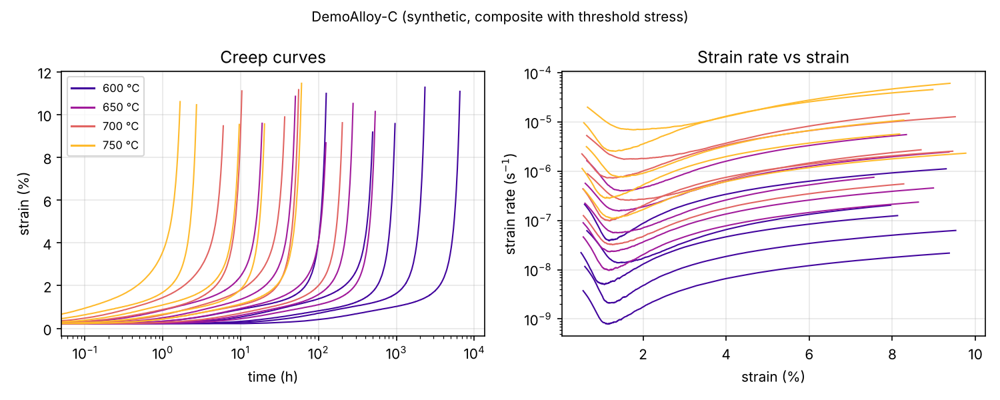
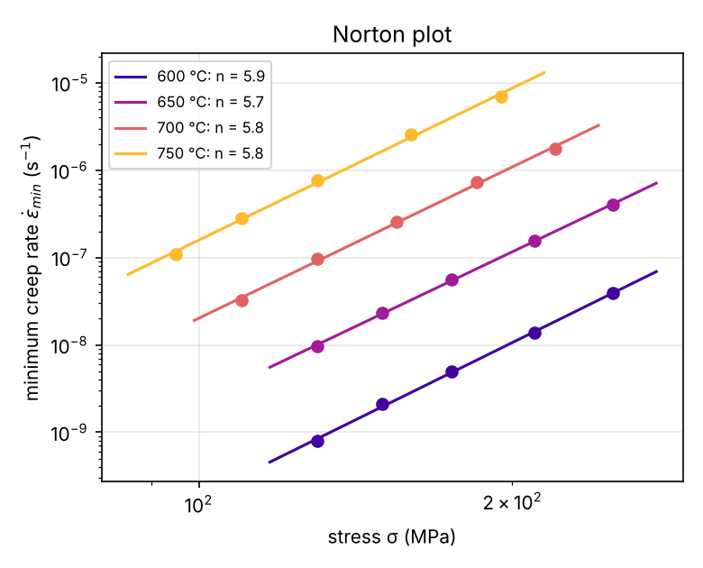
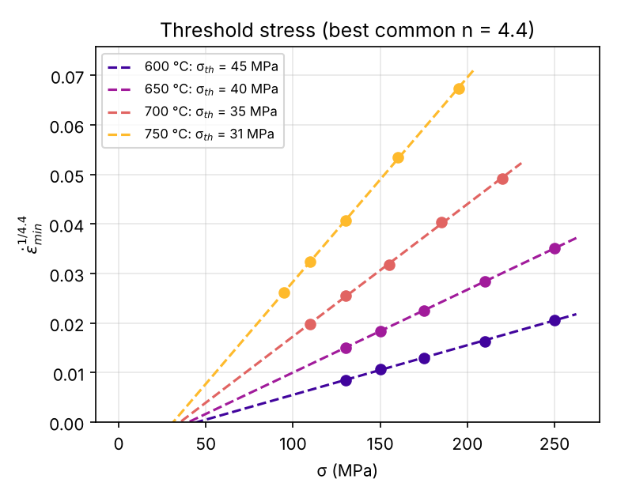
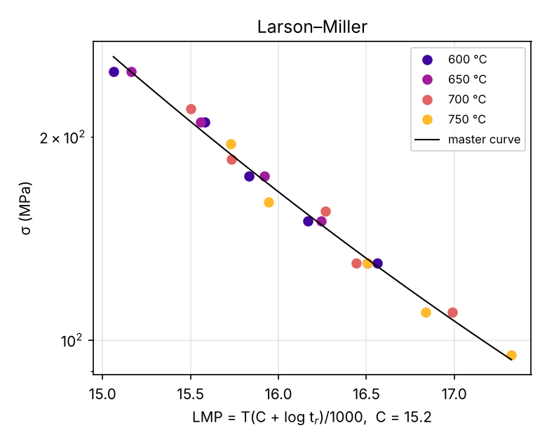

# 03 · Creep data analysis toolkit (`creepkit`)

A complete, tested pipeline for turning raw constant-load creep curves into constitutive
parameters and rupture-life correlations — the day-to-day analysis of a creep PhD.

## What it does

| Step | Method | Function |
|---|---|---|
| Strain rate from noisy LVDT/extensometer data | Savitzky–Golay derivative on a uniform time grid | `curves.strain_rate` |
| Minimum creep rate, primary / secondary / tertiary stages | rate within (1+tol)·ε̇_min | `curves.minimum_creep_rate`, `creep_stages` |
| Curve model | θ-projection (Evans & Wilshire) ε = ε₀ + θ₁(1−e^{−θ₂t}) + θ₃(e^{θ₄t}−1) | `curves.fit_theta_projection` |
| Stress exponent, activation energy | Norton (ln ε̇ vs ln σ), Arrhenius (ln ε̇ vs 1/T), **global** multiple regression with standard errors, modulus compensation σ/E(T) | `constitutive.fit_power_law` |
| Threshold stress (particle / composite strengthening) | ε̇^{1/n} vs σ extrapolation with a **common** n for all temperatures | `constitutive.threshold_stress_by_temperature` |
| Rupture life | Larson–Miller (fitted C + master curve, inversion for life), Monkman–Grant | `fit_larson_miller_constant`, `fit_monkman_grant` |
| Hot deformation | Garofalo sinh law / Zener–Hollomon parameter | `fit_sinh_law` |

Power-law creep with a threshold stress:

$$\dot\varepsilon_{min} = A\left(\frac{\sigma-\sigma_{th}}{E(T)}\right)^{n}\exp\left(-\frac{Q}{RT}\right)$$

Typical interpretation of n: ≈1 diffusional creep, ≈2 grain-boundary sliding, ≈3 solute-drag
glide, 4–5 dislocation climb, ≫5 → look for a threshold stress.

## Run it

```bash
python scripts/generate_synthetic_data.py                     # writes data/synthetic_*/
python scripts/analyze_creep.py data/synthetic_single_phase
python scripts/analyze_creep.py data/synthetic_composite
python scripts/analyze_creep.py /path/to/your/tests --name "CoCrFeNi (SPS)" --E-RT 200 --dEdT -0.06
```

Each test is one CSV file (see `data/template_creep_test.csv`): a few `# key: value`
header lines (stress, temperature, specimen id) and columns `time_h,strain`
(or `displacement_mm` + `gauge_length_mm`).

## Results on the synthetic validation datasets

The datasets in `data/` are **synthetic** (generated by `creepkit/synthetic.py` with known
parameters, noise, Monkman–Grant scatter) so the analysis can be checked against the truth.

| | true | recovered |
|---|---|---|
| Single phase: n | 4.5 | 4.40 ± 0.07 |
| Single phase: Q (modulus-compensated) | 290 kJ/mol | 282 ± 4 kJ/mol (apparent Q = 296) |
| Composite: apparent n, Q | – | 5.75, 332 kJ/mol (inflated by the threshold stress) |
| Composite: n_true from threshold analysis | 4.4 | 4.4 (best of 3 / 4.4 / 5 / 8) |
| Composite: σ_th at 600 / 650 / 700 / 750 °C | 45.7 / 41.4 / 37.2 / 32.9 MPa | 44.8 / 39.9 / 35.2 / 31.2 MPa |
| Composite: n, Q with σ − σ_th | 4.4, 300 kJ/mol | 4.39 ± 0.02, 294 ± 1 kJ/mol |
| Monkman–Grant m | 0.92 | 0.92 |

The ~3 % underestimate of Q and n is real and instructive: the measured *minimum* rate
contains contributions of the decaying primary and the accelerating tertiary terms, so it
is slightly higher than the "steady-state" rate used to generate the data.



| Norton | Threshold stress | Larson–Miller |
|---|---|---|
|  |  |  |

## Notes and next steps

* Real creep curves often need trimming of the loading transient; check the
  `primary_end_h` / `tertiary_start_h` columns of `summary.csv`.
* For tests interrupted before rupture set `# ruptured: false`; they are then excluded
  from the rupture correlations but used for minimum creep rates.
* Extensions: stress-change (dip) tests for internal stress, Wilshire equations, Θ-based
  long-term extrapolation, Bayesian parameter estimation.

## References

* F.R.N. Nabarro & H.L. de Villiers, *The Physics of Creep* (Taylor & Francis, 1995).
* M.E. Kassner, *Fundamentals of Creep in Metals and Alloys*, 3rd ed. (Butterworth-Heinemann, 2015).
* R.W. Evans & B. Wilshire, *Creep of Metals and Alloys* (Institute of Metals, 1985).
* Y. Li, S.R. Nutt & F.A. Mohamed, Acta Mater. 45 (1997) 2607 — threshold-stress analysis.
* F.R. Larson & J. Miller, Trans. ASME 74 (1952) 765; F.C. Monkman & N.J. Grant, Proc. ASTM 56 (1956) 593.
