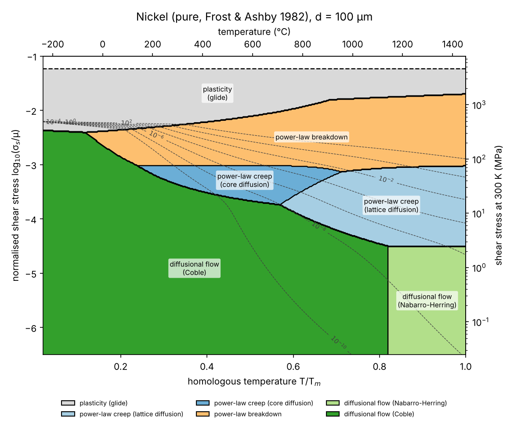
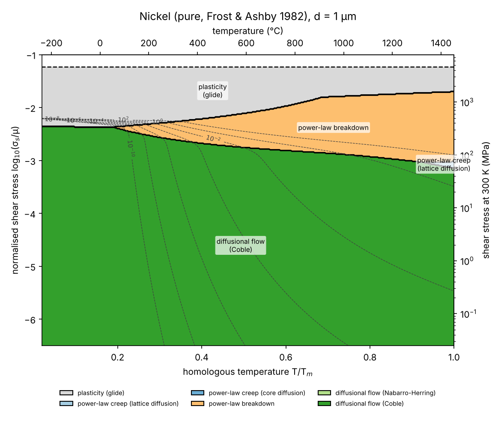
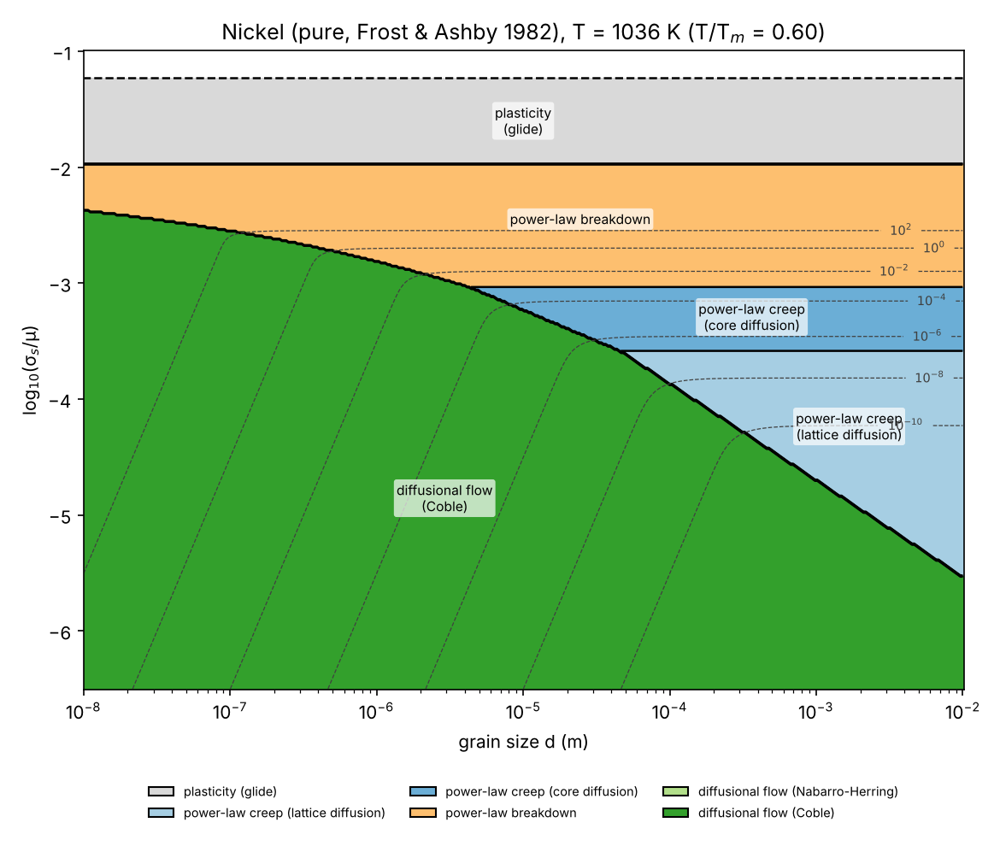
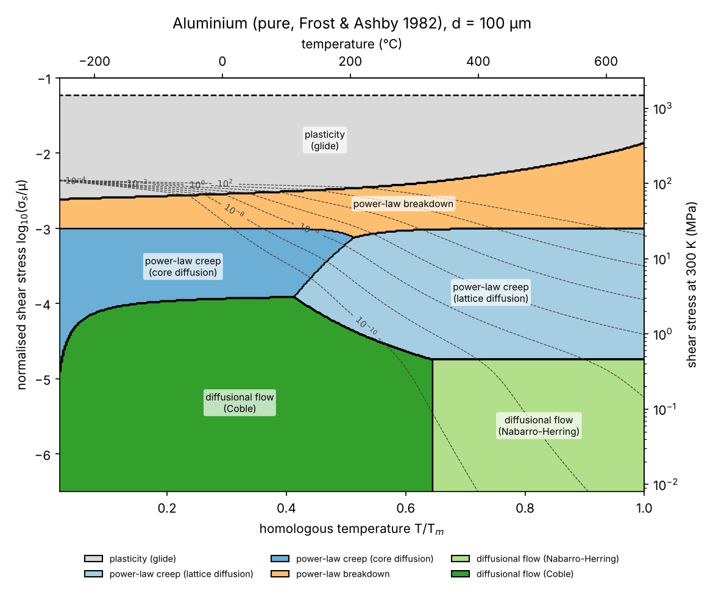

# 04 · Deformation-mechanism maps (`defmap`)

Ashby–Frost deformation-mechanism maps computed from the constitutive rate equations of
Frost & Ashby (1982): which mechanism controls deformation at a given stress,
temperature and grain size, and how fast.

## Physics

Shear stress σ_s, shear strain rate γ̇ (for uniaxial tests σ_s = σ/√3, γ̇ = √3 ε̇);
μ(T) = μ₀[1 + (T−300)/T_m · (T_m/μ₀)(dμ/dT)].

| Mechanism | Rate equation |
|---|---|
| Low-temperature plasticity (obstacle-controlled glide) | γ̇ = 2γ̇₀ e^{−ΔF/kT} sinh(ΔF σ_s / kT τ̂) |
| Power-law creep (lattice + dislocation-core diffusion) and power-law breakdown | γ̇ = (A D_eff μb/kT) [sinh(α′σ_s/μ)]ⁿ/α′ⁿ, D_eff = D_v + (10a_c/b²)(σ_s/μ)² D_c |
| Diffusional flow (Nabarro–Herring + Coble) | γ̇ = (42 σ_s Ω / kT d²) [D_v + (π/d) δD_b] |

Glide and dislocation creep are alternative mechanisms (the faster one operates), while
diffusional flow acts in parallel. Each pixel is coloured by the largest contribution;
dashed lines are contours of constant total strain rate (10⁻¹⁰ … 10² s⁻¹).

Two numerical details matter for a physically sensible map: the glide equation is used
with forward *and* backward activation (sinh form), and switched off where the work done
over the activation volume is below kT — otherwise it produces an artificial
"linear-viscous glide" field near the melting point.

## Run it

```bash
python scripts/make_maps.py                                   # Ni, Al, Cu at d = 1 and 100 µm
python scripts/make_maps.py --material nickel --d 1e-6 10e-6 100e-6
python scripts/make_maps.py --material materials/TEMPLATE_my_alloy.json --points my_tests.csv
```

`--points` overlays your test conditions (CSV columns `stress_MPa,T_C[,d_m,label]`, tensile
stress) so you can see which mechanism should control each creep test before you run it.

## Example maps

| Ni, d = 100 µm | Ni, d = 1 µm |
|---|---|
|  |  |

| Ni, stress–grain-size map at 0.6 T_m | Al, d = 100 µm |
|---|---|
|  |  |

Reducing the grain size from 100 µm to 1 µm makes Coble creep dominate almost the whole
low-stress region — the reason ultrafine-grained / nanocrystalline materials (e.g. milled
+ SPS-consolidated alloys) can creep faster than coarse-grained ones despite being
stronger at room temperature.

## Materials data

`materials/*.json` hold the parameter sets for pure Ni, Al and Cu transcribed from the
data tables of Frost & Ashby — **verify against the book before using them in a
publication**. To build a map for your own alloy, copy `TEMPLATE_my_alloy.json` and fill
in: lattice parameter and elastic constants (DFT, project 01), diffusion data (literature
or DFT, project 02), and n, A from your creep tests (project 03).

## References

* H.J. Frost & M.F. Ashby, *Deformation-Mechanism Maps: The Plasticity and Creep of Metals and Ceramics* (Pergamon, 1982).
* M.F. Ashby, Acta Metall. 20 (1972) 887.
