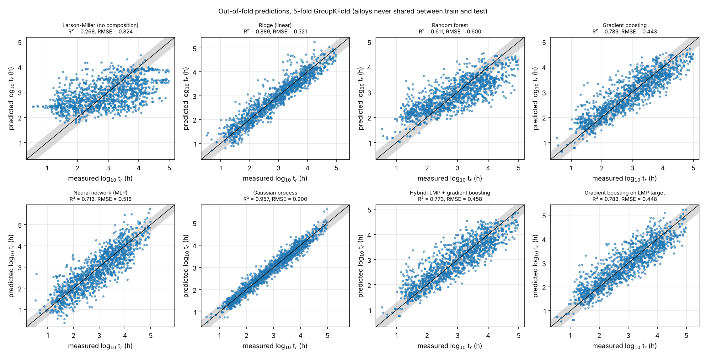
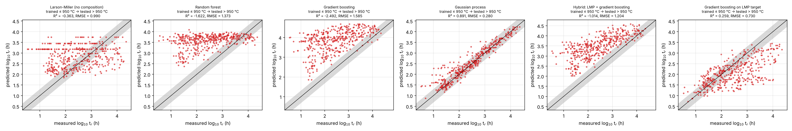
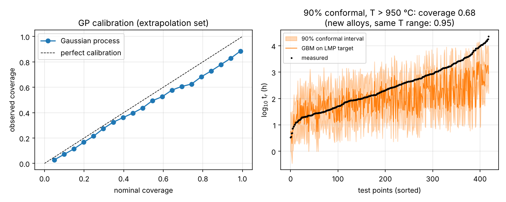
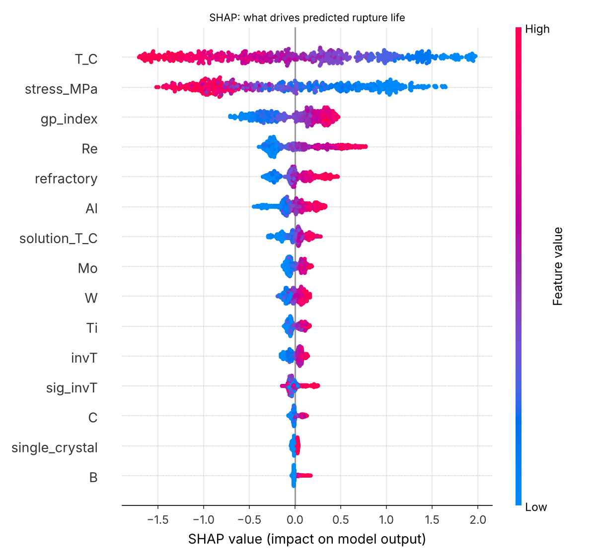

# 05 · Machine learning for creep-rupture life (`creepml`)

Predict the creep-rupture life of high-temperature alloys from composition, processing,
temperature and stress — with the validation, uncertainty and interpretability that a
materials-science audience (and a thesis committee) will ask for.

## Data

* **Real data:** drop a CSV with the columns in `creepml/data.py` (composition in wt.%,
  `single_crystal`, `solution_T_C`, `aging_T_C`, `T_C`, `stress_MPa`, `log10_rupture_h`,
  `alloy_id`) and run `--data your.csv`. Public sources: NIMS Creep Data Sheets (MatNavi),
  supplementary data of published ML creep studies (check licences).
* **Synthetic demo (default):** 1,215 tests on 120 Ni-base superalloy-like compositions
  generated from a hidden but physically motivated model — γ′-former content, refractory
  solid-solution strengthening (Re ≫ W, Mo), TCP-phase penalty, γ′-solvus collapse near
  the test temperature, single-crystal bonus, heat-to-heat and test scatter. Because the
  ground truth is known, every claim below can be checked. **These are not experimental
  results.**

## Methods

* Physics-informed features: 1000/T, ln σ, (ln σ)², ln σ·1000/T, γ′ index, refractory content …
* Models: composition-blind Larson–Miller master curve (engineering baseline), ridge,
  random forest, gradient boosting, MLP, Gaussian process (ARD Matérn kernel), hybrid
  (Larson–Miller + GBM on the residual), and GBM trained on the **Larson–Miller parameter**
  as target (temperature dependence built in exactly).
* Validation: 5-fold **GroupKFold by alloy**; extrapolation test (train T ≤ 950 °C,
  predict T > 950 °C).
* Uncertainty: GP predictive standard deviation (calibration curve) and split-conformal
  prediction intervals.
* Interpretability: SHAP values.
* Inverse design: GP upper-confidence-bound search for the longest life at 1000 °C / 200 MPa.

```bash
python scripts/train_evaluate.py          # ~10 min (the GP dominates)
```

## Results (synthetic superalloy dataset)

**Grouped cross-validation** (no alloy shared between training and test):

| Model | R² | RMSE (log₁₀ h) | within ×2 |
|---|---|---|---|
| Larson–Miller, no composition | 0.27 | 0.82 | 25 % |
| Random forest | 0.61 | 0.60 | 35 % |
| Neural network (MLP) | 0.71 | 0.52 | 42 % |
| Gradient boosting (raw target / LMP target / hybrid) | 0.79 / 0.78 / 0.77 | 0.44–0.46 | ~50 % |
| Ridge on physics features | 0.89 | 0.32 | 68 % |
| **Gaussian process** | **0.96** | **0.20** | **88 %** |

**Extrapolation to higher temperature** (trained ≤ 950 °C, tested > 950 °C):

| Model | R² | RMSE |
|---|---|---|
| Gaussian process | 0.89 | 0.28 |
| GBM on Larson–Miller target | 0.26 | 0.73 |
| Larson–Miller, no composition | −0.36 | 0.99 |
| Random forest / GBM (raw target) | −1.6 / −2.5 | 1.37 / 1.58 |

Lessons, all of which carry over to real creep databases:

1. **Data leakage is easy:** a random row split gives GBM R² = 0.90; splitting by alloy
   gives 0.79. Always group by alloy (or heat).
2. **Trees cannot extrapolate** — they predict a constant outside the training range.
   Building the physics into the target (Larson–Miller parameter) or using smooth models
   (GP, physics-feature ridge) is what makes extrapolation possible.
3. **Small data favours smooth, physics-informed models** over deep/ensemble models.
4. **Uncertainty estimates break under distribution shift:** 90 % split-conformal intervals
   (GBM on the LMP target, half-width ≈ ±1 decade) cover **95 %** of tests on *new alloys*
   in the training temperature range, but only **68 %** when extrapolating to T > 950 °C;
   the GP's nominal 90 % intervals cover 79 % there.
5. **Inverse design works but is optimistic:** the GP-UCB search found compositions whose
   *true* life at 1000 °C / 200 MPa (10^5.6 h) exceeds the best alloy in the training set
   (10^5.3 h), while the model over-predicted them (10^6.6 h) — exploit the model, then
   verify experimentally.

| Grouped CV parity plots |
|---|
|  |

| Extrapolation | Uncertainty | SHAP |
|---|---|---|
|  |  |  |

SHAP recovers the hidden physics: temperature and stress dominate, followed by the γ′
index, Re, refractory content and Al.

## References

* Y. Liu et al., *Acta Mater.* 195 (2020) 454 — ML creep-rupture life of Ni-base single crystals.
* D. Shin et al., *Acta Mater.* 168 (2019) 321 — ML for creep of heat-resistant steels.
* A.N. Angelopoulos & S. Bates, *A Gentle Introduction to Conformal Prediction* (2021).
* S.M. Lundberg & S.-I. Lee, *NeurIPS* (2017) — SHAP.
