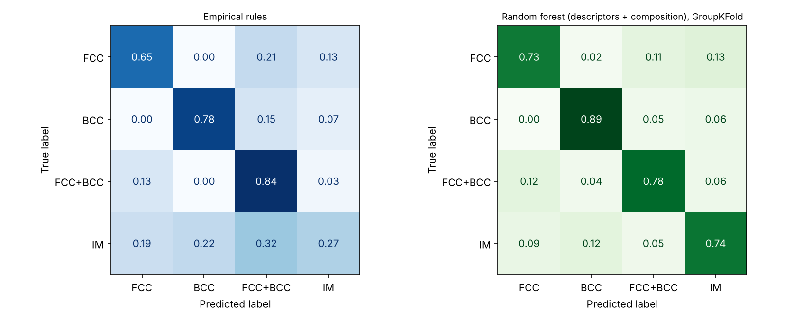
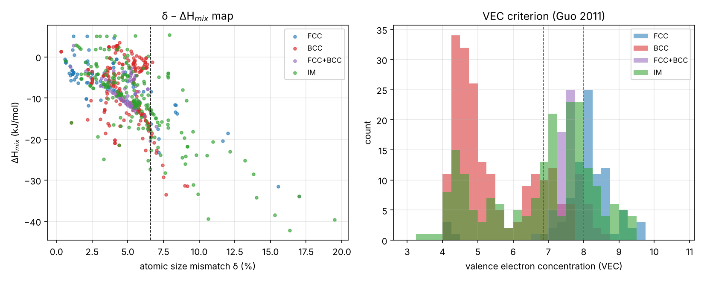
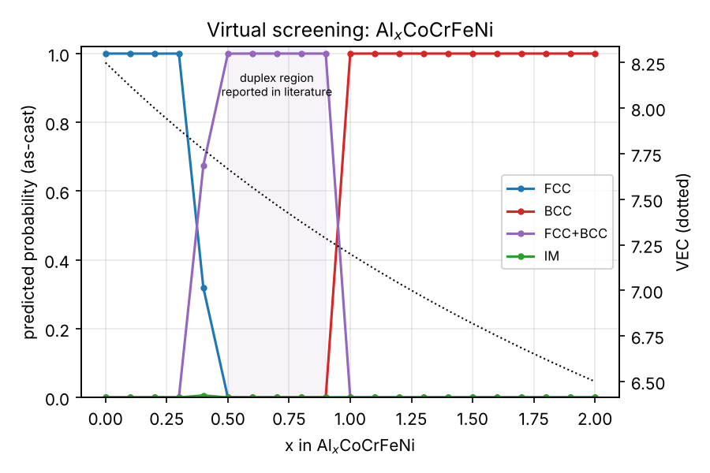
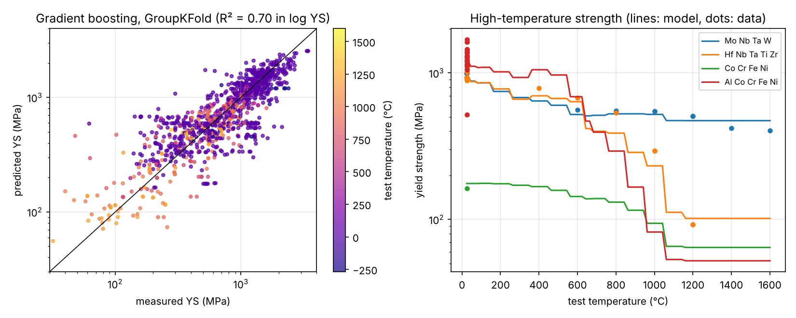

# 06 · Machine learning for high/medium-entropy alloys: phase and strength (`heaml`)

Predict the phases (FCC / BCC(+B2) / FCC+BCC / intermetallic-containing) and the yield
strength vs temperature of multi-principal-element alloys from composition and processing,
using the **real, published MPEA dataset** (Borg et al., *Sci. Data* 7, 430 (2020); 1,545
entries, 630 compositions, Apache-2.0 licence).

## Descriptors (all computed from composition)

| Symbol | Meaning | Formula |
|---|---|---|
| δ | atomic-size mismatch | 100·√(Σcᵢ(1 − rᵢ/r̄)²) |
| ΔH_mix | mixing enthalpy (Miedema, Takeuchi–Inoue binaries) | Σᵢ<ⱼ 4ΔHᵢⱼcᵢcⱼ |
| ΔS_mix | ideal configurational entropy | −RΣcᵢ ln cᵢ |
| Ω | entropy/enthalpy competition | T_m ΔS_mix / \|ΔH_mix\| |
| VEC | valence-electron concentration | Σcᵢ VECᵢ |
| Δχ, Λ, γ | electronegativity difference, ΔS/δ², packing parameter | — |

Validated against literature values: CoCrFeNi ΔH_mix = −3.75 kJ/mol, VEC = 8.25;
AlCoCrFeNi ΔH_mix = −12.32 kJ/mol, VEC = 7.2 (unit tests in `tests/`).

## Run it

```bash
python scripts/phase_and_strength.py
```

## Results

**Phase classification** (549 composition–processing entries; 5-fold *GroupKFold* so that
the same composition never appears in both training and test folds):

| Model | Features | Accuracy | Macro-F1 |
|---|---|---|---|
| Empirical rules (Yang–Zhang Ω–δ + Guo VEC) | descriptors | 0.58 | 0.56 |
| Logistic regression | descriptors + composition | 0.67 | 0.62 |
| SVM (RBF) | descriptors + composition | 0.78 | 0.75 |
| Gradient boosting | descriptors + composition | 0.79 | 0.77 |
| **Random forest** | descriptors + composition | **0.80** | **0.78** |

VEC is by far the most important descriptor (permutation importance), in line with the
classical FCC/BCC criterion — but ML adds ~20 percentage points of accuracy over the rules,
mainly by recognising intermetallic-forming chemistries.

| Confusion matrices | Descriptor maps |
|---|---|
|  |  |

**Virtual screening of Al_xCoCrFeNi** (as-cast): the model predicts FCC for x ≤ 0.3,
FCC+BCC for 0.4 ≤ x ≤ 0.9 and BCC/B2 for x ≥ 1.0 — matching the experimentally reported
transitions (FCC → duplex at x ≈ 0.4–0.5, BCC above x ≈ 0.9).

For the two constituents of a dual-phase MEA composite processed by powder metallurgy,
CoCrFeNi is predicted single FCC (p = 1.00) and AlCoCrFe BCC/B2 (p = 0.52, FCC+BCC 0.39).



**Yield strength vs test temperature** (1,067 compression/tension entries, GroupKFold):
R² = 0.70 on log(YS), median absolute error ≈ 21 %. Tree models give step-like curves
versus temperature because of sparse high-temperature data; a monotonic-constraint
model or physics-based features (e.g. modulus-normalised strength) is a natural next step.



## Caveats

* Literature data mix processing routes, grain sizes and test conditions; label noise
  limits achievable accuracy (the same nominal composition is reported with different
  phases by different groups — conflicting pairs are removed).
* "BCC" includes ordered B2; distinguishing them needs ordering descriptors (e.g. the
  ΔH of the most negative binary pair) and better labels.
* Predictions outside the composition space of the data (e.g. new refractory chemistries)
  are extrapolations — check the nearest neighbours in the training set.

## References

* C.K.H. Borg et al., *Sci. Data* 7 (2020) 430 — dataset.
* A. Takeuchi & A. Inoue, *Mater. Trans.* 46 (2005) 2817 — mixing enthalpies.
* S. Guo et al., *J. Appl. Phys.* 109 (2011) 103505 — VEC criterion.
* X. Yang & Y. Zhang, *Mater. Chem. Phys.* 132 (2012) 233 — Ω–δ criterion.
* W. Huang, P. Martin & H.L. Zhuang, *Acta Mater.* 169 (2019) 225 — ML phase prediction of HEAs.
