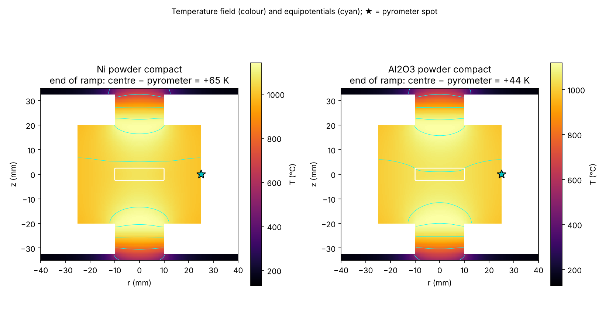
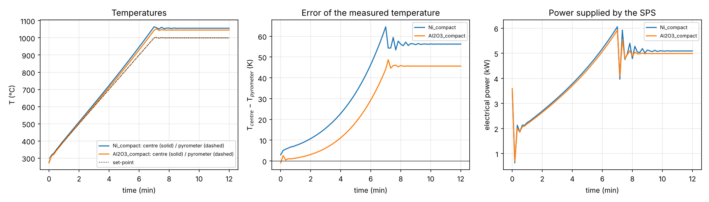
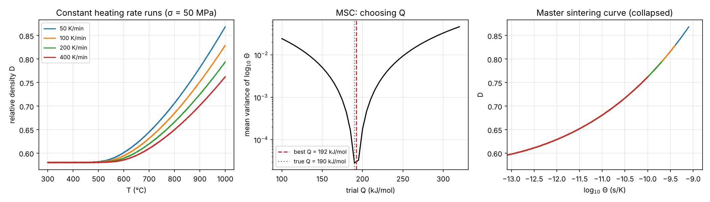
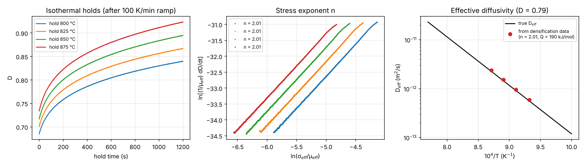

# 07 · Spark plasma sintering: Joule heating and densification kinetics (`spsmodel`)

Two linked models of SPS/FAST processing:

* **A — electro-thermal model** of the graphite tool stack: where the current flows, how
  much hotter (or colder) the powder is than the pyrometer spot on the die, and how this
  differs between conductive metal powders and insulating ceramics.
* **B — densification kinetics**: creep-based densification model (Bernard-Granger &
  Guizard), extraction of the stress exponent n, activation energy Q and an effective
  diffusivity D_eff from SPS densification curves; the master sintering curve (MSC).

## A. Electro-thermal finite-volume model

Axisymmetric r–z grid (0.5 mm cells) of a 20 mm SPS set-up: two graphite spacers, two
punches, die (OD 50 mm, height 40 mm) and a 5 mm thick powder compact.

$$\nabla\cdot(\sigma_e\nabla\phi)=0,\qquad \rho c_p\frac{\partial T}{\partial t}=\nabla\cdot(k\nabla T)+\sigma_e|\nabla\phi|^2$$

* Temperature-dependent properties of graphite and powder compacts; compact
  conductivities scale with relative density through a percolation law.
* Boundary conditions: fixed potential and water-cooled contact on the ram faces,
  grey-body radiation from every surface facing the vacuum chamber.
* A PI controller adjusts the current so that the **pyrometer** (die outer wall, mid-height)
  follows the programme (100 K/min to 1000 °C, 5 min hold).
* Implicit time integration with sparse direct solvers; Joule heat computed from face
  dissipation G(Δφ)², so energy is conserved exactly.

```bash
python scripts/run_electrothermal.py          # ~3 min
```

| | Ni compact (D = 0.65) | Al₂O₃ compact (D = 0.60) |
|---|---|---|
| T_centre − T_pyrometer, end of ramp | **+65 K** | **+44 K** |
| T_centre − T_pyrometer, during hold | +56 K | +46 K |
| Radial gradient in the sample (hold) | 20 K | 13 K |
| Current / voltage / power (hold) | 1.59 kA / 3.2 V / 5.1 kW | 1.56 kA / 3.2 V / 5.0 kW |
| Fraction of current through the sample | 33 % | 0 % |




The hottest parts of the stack are the punches just outside the die (current
constriction), and the radiating die surface — where the pyrometer looks — is the coldest
part of the hot zone. The conductive compact additionally heats itself (one third of the
current passes through it), which is why metal powders show the larger temperature
error. These trends are consistent with published SPS measurements and simulations;
exact numbers depend on contact resistances, which are neglected here (add them as
interface conductances to calibrate against a thermocouple run).

## B. Densification kinetics

$$\frac{1}{\mu_{eff}}\frac{dD}{dt} = K\,\frac{b\,D_{eff}}{kT}\left(\frac{b}{G}\right)^{p}\left(\frac{\sigma_{eff}}{\mu_{eff}}\right)^{n},\qquad
\sigma_{eff}=\sigma\frac{1-D_0}{D^2(D-D_0)},\quad \mu_{eff}=\frac{E}{2(1+\nu)}\frac{D-D_0}{1-D_0}$$

```bash
python scripts/run_densification.py           # seconds; uses results of part A for the bias study
```

Synthetic densification curves are generated from a known "true" model (n = 2,
Q = 190 kJ/mol) with measurement noise, then analysed exactly as experimental SPS logs
would be:

| Method | Recovered | True |
|---|---|---|
| Master sintering curve, 4 heating rates (50–400 K/min) | Q = 192 kJ/mol | 190 |
| Bernard-Granger, isothermal holds 800–875 °C: n | 2.01 | 2.0 |
| Bernard-Granger: Q (Arrhenius at constant D) | 190 kJ/mol | 190 |
| D_eff at 800–875 °C | within 5 % | — |
| **Q when the pyrometer temperature is used** (sample 56 K hotter, from part A) | **174 kJ/mol (−9 %)** | 190 |




The last row links the two parts: an uncorrected Joule-heating offset biases the
activation energy and hence the diffusion mechanism inferred from SPS data.

## Using real SPS data

Replace the simulated `(t, T, D)` in `scripts/run_densification.py` with your run log:
relative density from the punch displacement (corrected for tool expansion with a blank
run and anchored to the final Archimedes density), and the temperature corrected with
part A (or a calibration run with a thermocouple in the sample).

## References

* N. Chawake et al., *Scripta Mater.* 93 (2014) 52 — Joule heating during SPS of metal powders.
* G. Bernard-Granger & C. Guizard, *Acta Mater.* 55 (2007) 3493 — creep-based densification analysis.
* H. Su & D.L. Johnson, *J. Am. Ceram. Soc.* 79 (1996) 3211 — master sintering curve.
* U. Anselmi-Tamburini et al., *Mater. Sci. Eng. A* 394 (2005) 139 — current and temperature distributions in SPS.
* K. Vanmeensel et al., *Acta Mater.* 53 (2005) 4379 — modelling of temperature distribution during SPS.
