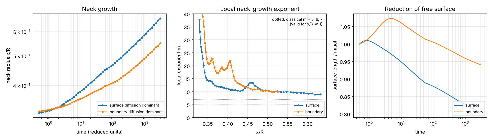
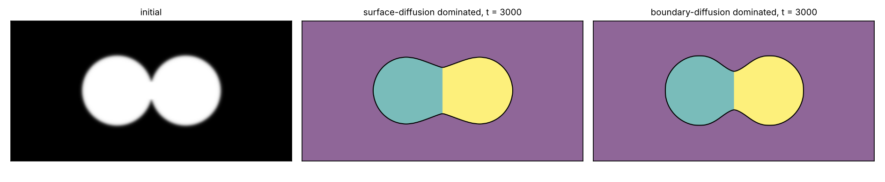
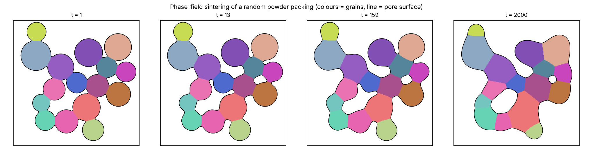
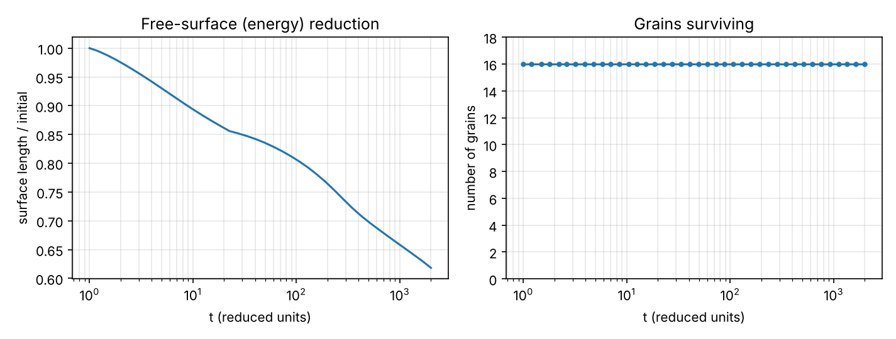

# 08 · Phase-field model of solid-state sintering (`pfsinter`)

A compact, fully vectorised implementation of the Wang (2006) phase-field model of
solid-state sintering: neck formation between particles, pore rounding and grain growth,
with the dominant diffusion path (surface vs grain boundary) selected through the mobility.

## Model

Conserved density ρ (1 = solid, 0 = pore) and one non-conserved order parameter ηᵢ per
particle/grain:

$$f = A\rho^2(1-\rho)^2 + B\Big[\rho^2 + 6(1-\rho)\sum\eta_i^2 - 4(2-\rho)\sum\eta_i^3 + 3\big(\sum\eta_i^2\big)^2\Big]$$

$$\frac{\partial\rho}{\partial t}=\nabla\cdot\Big(M\nabla\frac{\delta F}{\delta\rho}\Big),\qquad
\frac{\partial\eta_i}{\partial t}=-L\frac{\delta F}{\delta\eta_i}$$

$$M = M_{vol}\,\phi(\rho)+M_{vap}\,[1-\phi(\rho)]+M_{surf}\,16\rho^2(1-\rho)^2+M_{gb}\sum_{i\ne j}\eta_i\eta_j$$

The surface term is active only where ρ ≈ ½ (free surface) and the grain-boundary term
only where two grains meet, so the ratio M_surf/M_gb decides which path carries the
matter. Time integration: semi-implicit Fourier-spectral scheme with linear stabilisation
(periodic boundaries), ~10–100× larger time steps than explicit Euler, mass conserved to
machine precision (unit-tested).

**Not included:** rigid-body motion of particles (Wang's advection term), so shrinkage
(centre-to-centre approach) is not captured — neck growth, surface smoothing and grain
growth are. Adding the advection velocity is a natural extension project.

## Run it

```bash
python scripts/two_particle_neck_growth.py      # neck growth, surface vs grain-boundary diffusion
python scripts/multi_particle_sintering.py      # random powder aggregate, snapshots + GIF
python scripts/two_particle_neck_growth.py --quick   # 20-second test
```

## Results

**Two particles (R = 40 grid units), surface- vs grain-boundary-diffusion dominated:**

| | surface (M_surf/M_gb = 100) | grain boundary (M_gb/M_surf = 10) |
|---|---|---|
| neck radius x/R at t = 3000 | 0.66 | 0.55 |
| apparent exponent m, (x/R)^m ∝ t, fitted for x/R = 0.25–0.6 | 12.2 | 17.2 |
| local exponent m once x/R > 0.45 | ≈ 10 | ≈ 10 |




How to read this honestly:

* The classical exponents (m ≈ 5 volume, 6 grain-boundary, 7 surface diffusion) are derived
  for **x/R ≪ 1**. Because of the diffuse interface, the simulated neck starts at
  x/R ≈ 0.33. The measured m therefore describes the *later* stage, where growth slows as
  the neck approaches its equilibrium (dihedral-angle) shape. The local-exponent panel
  shows this directly: m falls with x/R and levels off near 10. Reaching the classical
  regime needs particles many times larger than the interface width (a much finer grid;
  try `two_particles(..., combine="max")` with a larger R as an exercise).
* Surface diffusion grows the neck faster and smooths the surface steadily. When
  grain-boundary diffusion dominates, the free surface first *lengthens* (t < 5) as a
  groove forms where the boundary meets the surface, then decreases.
* Without rigid-body motion neither case densifies (centre distance is fixed). In real
  sintering, grain-boundary diffusion is the densifying path; surface diffusion only
  coarsens.

**Random powder aggregate (16 particles, 256 × 256):** necks form at every contact,
narrow channels pinch off into closed pores, pores round off and shrink, and the free
surface falls to 62 % of its initial length by t = 2000. All 16 grains survive over this
time (grain growth would need longer times or a size distribution with smaller particles).




The animation `results/multi_particle.gif` shows the full evolution.

## Connecting to experiments

* Units are reduced (grid spacing and time scale set by the mobilities). To map to real
  time, calibrate M_surf and M_gb with δD_s and δD_gb (e.g. from project 02 / Frost–Ashby
  data) and the interface width with the surface energy.
* Compare simulated neck sizes with SEM fractographs of interrupted SPS runs, and grain
  growth with EBSD.
* For SPS, add a temperature field from project 07 (mobilities ∝ exp(−Q/RT)) and an
  applied-stress term.

## References

* Y.U. Wang, *Acta Mater.* 54 (2006) 953 — phase-field model of sintering with rigid-body motion.
* R.L. Coble, *J. Am. Ceram. Soc.* 41 (1958) 55 — initial-stage sintering kinetics.
* L.-Q. Chen & J. Shen, *Comput. Phys. Commun.* 108 (1998) 147 — semi-implicit Fourier-spectral method.
* G.C. Kuczynski, *Trans. AIME* 185 (1949) 169 — neck-growth laws.
