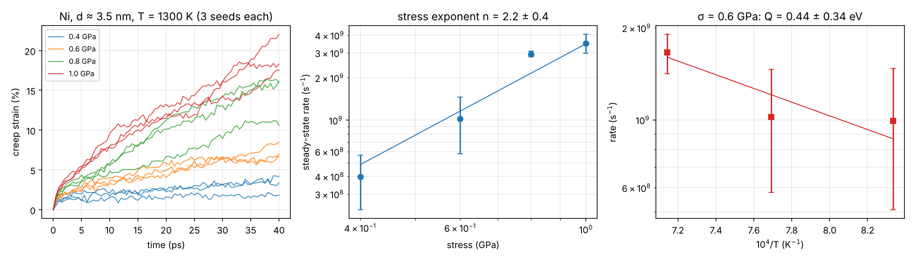

# 09 · Molecular-dynamics creep of nanocrystalline metals (`mdcreep`)

Constant-stress molecular-dynamics "creep tests" on periodic nanocrystalline
polycrystals — the atomistic counterpart of project 03 and of the nanograined alloys
produced by milling + SPS.

## What is here

| Path | What |
|---|---|
| `mdcreep/polycrystal.py` | dependency-free periodic Voronoi polycrystal builder (fcc, bcc, **B2**), random grain orientations, overlap removal at boundaries |
| `mdcreep/lammps_creep.py` | LAMMPS (Python module): minimisation → NPT equilibration → constant uniaxial stress via the barostat; CNA structure analysis |
| `mdcreep/analysis.py` | steady-state rate, stress exponent, activation energy |
| `scripts/run_md_creep.py` | stress and temperature series → n and Q, figures |
| `scripts/build_polycrystal.py` + `lammps_inputs/in.nc_creep.lmp` | the same workflow as a plain LAMMPS input for `mpirun` on a cluster |
| `potentials/` | Ni (Foiles–Baskes–Daw 1986, EAM) and B2 CoAl (Vailhe & Farkas 1997, EAM), from the LAMMPS distribution |

```bash
python scripts/run_md_creep.py                    # nanocrystalline Ni, ~1 h on 2 cores
python scripts/run_md_creep.py --material CoAl    # B2 CoAl
python scripts/run_md_creep.py --quick            # 1-minute smoke test
# cluster:
python scripts/build_polycrystal.py --material Ni --box 150 --grains 16 --out nc.data
mpirun -np 64 lmp -in lammps_inputs/in.nc_creep.lmp -var T 1300 -var sigma 1.0 -var data nc.data
```

## Results (nanocrystalline Ni, demo size)

Periodic box 4.5 nm, 4 grains (d ≈ 3.5 nm, 7,886 atoms, ~41 % of atoms in grain
boundaries), Foiles EAM; 10 ps NPT equilibration + 40 ps at constant tensile stress;
**3 independent velocity seeds per condition** (`results/Ni/rates.csv`):

| T (K) | σ (GPa) | mean rate (s⁻¹) | std. error |
|---|---|---|---|
| 1300 | 0.4 | 4.0 × 10⁸ | 1.7 × 10⁸ |
| 1300 | 0.6 | 1.0 × 10⁹ | 0.4 × 10⁹ |
| 1300 | 0.8 | 2.9 × 10⁹ | 0.1 × 10⁹ |
| 1300 | 1.0 | 3.5 × 10⁹ | 0.5 × 10⁹ |
| 1200 | 0.6 | 1.0 × 10⁹ | 0.5 × 10⁹ |
| 1400 | 0.6 | 1.7 × 10⁹ | 0.2 × 10⁹ |

* **Stress exponent n = 2.2 ± 0.4** — far below the n ≈ 4–5 of dislocation climb in
  coarse-grained Ni and consistent with grain-boundary-mediated creep (Coble diffusion and
  grain-boundary sliding, n ≈ 1–2), as expected for 3.5 nm grains.
* **Activation energy Q = 0.44 ± 0.34 eV** — poorly constrained: three temperatures with
  this much run-to-run scatter cannot pin it down. It is at most of the order of the
  grain-boundary diffusion energy of Ni (~1.2 eV), as MD studies of nanocrystalline metals
  under GPa stresses often find. More temperatures and seeds are needed for a real number.



**Why seed averaging matters.** A first attempt used one run per condition at higher
stresses (0.6–1.2 GPa). It gave n = 4.8 and a rate at 1400 K *lower* than at 1300 K
(an unphysical, non-monotonic Arrhenius plot). At the same nominal condition, individual
runs differ by up to a factor of ~9 because a 4-grain box deforms through a few discrete
sliding events. Averaging independent runs (and better still, several microstructures and
larger boxes) is essential before quoting n or Q from MD.

## Reading MD creep results critically

* **Time scale.** MD reaches nanoseconds, so stresses of ~0.5–1 GPa and T ≈ 0.7–0.8 T_m
  are needed for measurable strain; rates of 10⁷–10⁹ s⁻¹ are ~10 orders above laboratory
  creep. Use MD for *mechanisms* and *trends* (n vs grain size, role of boundary
  diffusion and sliding), not for absolute rates.
* **Size.** The demo box (4.5 nm, 4 grains) is tiny; grain-boundary atoms are a large
  fraction of the sample. Production work needs ≥ 15 nm boxes with 10–20 grains, several
  random seeds per condition and ≥ 1 ns per run.
* **Potential.** EAM potentials are fitted to a few properties; check the stacking-fault
  energy, vacancy formation/migration energies and melting point of the potential (compare
  with projects 01–02) before interpreting activation energies.
* **Analysis.** Visualise `results/Ni/final.dump` in OVITO (common-neighbour analysis
  colouring) to see grain-boundary sliding, dislocation emission and grain rotation.

## References

* V. Yamakov, D. Wolf, S.R. Phillpot & H. Gleiter, *Acta Mater.* 50 (2002) 61 — grain-boundary diffusion creep in nanocrystalline Pd by MD.
* A.P. Thompson et al., *Comput. Phys. Commun.* 271 (2022) 108171 — LAMMPS.
* S.M. Foiles, M.I. Baskes & M.S. Daw, *Phys. Rev. B* 33 (1986) 7983 — EAM for Ni.
* R. Vailhé & D. Farkas, *J. Mater. Res.* 12 (1997) 2559 — EAM for B2 CoAl.
* A. Stukowski, *Model. Simul. Mater. Sci. Eng.* 18 (2010) 015012 — OVITO.
