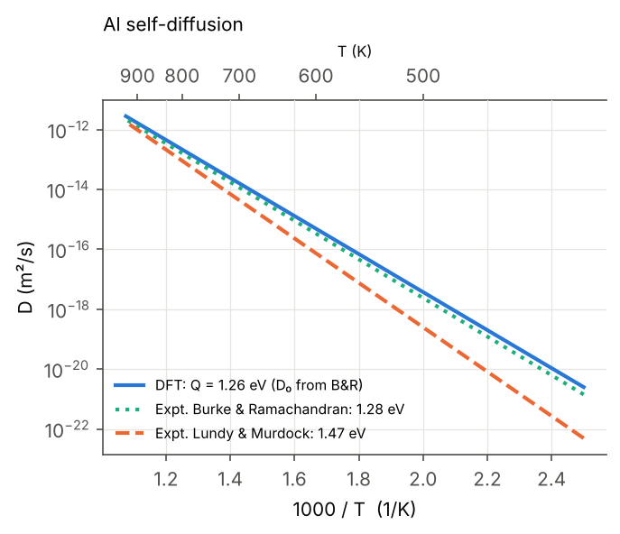
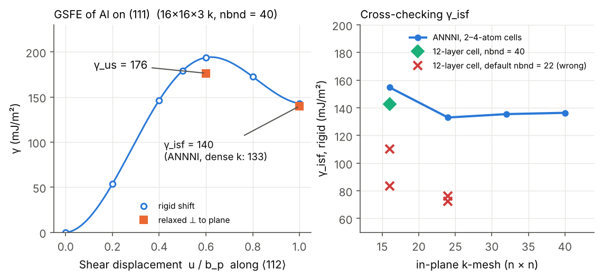

# 10 · First-principles creep parameters of fcc Al (Quantum ESPRESSO, PBE)

Every creep law needs a short list of material parameters: the shear modulus G and Burgers
vector b that scale the stress, the activation energy Q of lattice diffusion, and the
stacking-fault energy γ that sets how widely dislocations dissociate. This project computes all
of them for aluminium from density-functional theory, checks each one against experiment, and
carries them into creep-rate predictions.

Projects 01 and 02 build the same workflow with ASE and test it on a toy potential; here every
DFT calculation has been run to convergence with plain `pw.x` input files, and all inputs and
outputs are committed in `runs/`.

$$E_f^v = E_{N-1} - \tfrac{N-1}{N}E_N,\qquad Q = E_f + E_m,\qquad D = D_0\,e^{-Q/kT}$$

$$\gamma_{isf}^{ANNNI} = \frac{E_{hcp} + 2E_{dhcp} - 3E_{fcc}}{A}$$

$$\dot\varepsilon_{MBD} = A\,\frac{DGb}{kT}\left(\frac{\gamma}{Gb}\right)^{3}\left(\frac{\sigma}{G}\right)^{n},\qquad
\dot\varepsilon_{NH} = 14\,\frac{\Omega D\sigma}{kTd^{2}}$$

## Workflow

| Script | What it does | Key result |
|---|---|---|
| `01_convergence.py` | cutoff and k-point tests (1-atom cell) | 40 Ry; 1 meV/atom |
| `02_bulk.py` | Birch–Murnaghan EOS + elastic constants from volume-conserving strains (Mehl 1990) at k = 24, 32, 40 | a₀ = 4.037 Å, B = 78 GPa |
| `03_vacancy.py` | vacancy in a 32-site cell, unrelaxed and relaxed | E_f = 0.647 eV (6³ k) |
| `05_migration.py` | constrained-saddle vacancy jump (mover fixed at the midpoint, all others relaxed) | E_m = 0.63 eV (4³ k) |
| `05c_kpoint_check.py` | E_f and E_m re-evaluated on 6³ and 8³ k-meshes | E_f = 0.667, E_m = 0.593 eV |
| `05b_write_neb_input.py` | writes a CI-NEB input (`neb.x`) for the same jump, for a cluster | – |
| `04_gsfe.py` | first GSFE pass (12-layer tilted cell); affected by the `nbnd` problem below, kept for its relaxed geometries | – |
| `04b_gsfe_kcheck.py`, `04d_tilt_test.py` | k-point and cell-shape diagnostics that exposed the problem | – |
| `04c_isf_annni.py` | γ_isf from hcp/dhcp/fcc energies (ANNNI), k up to 40³ | 136 mJ/m² (rigid) |
| `04f_gsfe_final.py` | corrected GSFE: `nbnd = 40`, 16×16×3 k | γ_us = 176, γ_isf = 140 mJ/m² |
| `06_creep_analysis.py` | figures, D(T), power-law and Nabarro–Herring creep rates | Q = 1.26 eV |

## How to run

```bash
conda activate dft                 # conda-forge: qe openmpi numpy scipy matplotlib
cd 10-dft-al-creep-parameters
./run_all.sh                       # reuses the committed outputs in runs/ (seconds)
./run_all.sh --fresh               # moves them to reference_results/ and recomputes (~5-8 h, 4 cores)
pytest tests                       # no pw.x needed
```

`NPROC` (default 4) and `QE_PW` (default: `pw.x` on the PATH) are environment variables. The run is
resumable: any `pw.x` output that already contains `JOB DONE` is skipped. Do not use Ubuntu's
`quantum-espresso` apt package (its QE 6.7 build crashes with "buffer overflow detected"); use the
conda-forge `qe` package. The pseudopotential was generated with `ld1.x < pseudo/Al.in` (pslibrary
0.1, PBE, ultrasoft).

## Results (PBE)

| Quantity | This work | Experiment |
|---|---|---|
| Lattice parameter a₀ (Å) | 4.037 | 4.0496 (298 K) |
| Bulk modulus B (GPa) | 77.9 | 79.4 (0 K) |
| C₁₁ / C₁₂ / C₄₄ (GPa), 40³ k | 113.6 / 60.0 / 35.5 | 114.3 / 61.9 / 31.6 (0 K, Kamm & Alers) |
| Shear modulus G, Voigt–Reuss–Hill (GPa) | 31.7 | 29.3 (0 K, from the same C_ij) |
| Vacancy formation energy E_f (eV) | 0.667 | 0.67 ± 0.03 |
| Vacancy migration energy E_m (eV) | 0.593 | ≈ 0.6 |
| Self-diffusion activation energy Q (eV) | **1.26** | 1.28 (Burke & Ramachandran); 1.47 (Lundy & Murdock, high T) |
| Intrinsic stacking-fault energy γ_isf (mJ/m²) | 134–140 | 120–166 (range of reported measurements) |
| Unstable stacking-fault energy γ_us (mJ/m²) | 176 | – |
| γ_isf / Gb | 0.015 | – |

At 600 K an error of 0.1 eV in Q changes a creep rate by a factor of 7, so the agreement of Q to
0.02 eV with the lower-temperature diffusion data is the number that matters most here.




Other figures: `fig1_convergence.png`, `fig2_eos.png`, `fig3_elastic_k.png`, `fig4_migration.png`.

## Lessons learned

1. **Long cells need explicit `nbnd`.** In the 12-layer stacking-fault cell the default number of
   bands left partly occupied states out, which made the energy per atom 14.5 meV too high
   without any warning. The ANNNI estimate, an independent method, is what exposed the problem.
   The fix is `nbnd = 40`.
2. **Al elastic constants need dense k-sampling.** C₄₄ changes from 19 to 35 GPa between 24³
   and 40³ k-points. The stress–strain method at ±1 % strain was too noisy; the energy–strain
   method with larger, symmetric strains is far more stable.
3. **Check defect energies on a denser k-mesh.** E_f from 4³ k was 0.12 eV too low; the
   geometries relaxed with 4³ k and re-evaluated at 6³ and 8³ k agree to 0.02 eV.

## Limitations and how to go further

* A 32-site cell has a finite-size error of a few hundredths of an eV in E_f; check with a
  108-site cell (3×3×3).
* The diffusion prefactor D₀ and the creep constants A and n come from experiment; a phonon
  calculation (harmonic transition-state theory) would give the attempt frequency and the
  formation entropy.
* PBE underestimates vacancy formation energies through the surface error (Carling 2000;
  Mattsson & Mattsson 2002). For Al this error is small, but it is larger for transition metals.
* The same scripts carry over to Ni, Ni₃Al and B2 NiAl, which are the next steps toward
  superalloys and intermetallics.

## References

* M.J. Mehl, *Phys. Rev. B* 41 (1990) 10311 — volume-conserving strains for elastic constants.
* G.N. Kamm & G.A. Alers, *J. Appl. Phys.* 35 (1964) 327 — Al elastic constants, 4–300 K.
* T.S. Lundy & J.F. Murdock, *J. Appl. Phys.* 33 (1962) 1671 — self-diffusion in Al.
* J. Burke & T.R. Ramachandran, *Metall. Trans.* 3 (1972) 147 — self-diffusion in Al at low temperature.
* P.J.H. Denteneer & W. van Haeringen, *J. Phys. C* 20 (1987) L883 — ANNNI stacking-fault energies.
* A.K. Mukherjee, J.E. Bird & J.E. Dorn, *Trans. ASM* 62 (1969) 155 — the power-law creep equation.
* K. Carling et al., *Phys. Rev. Lett.* 85 (2000) 3862 — vacancies in Al from first principles.
