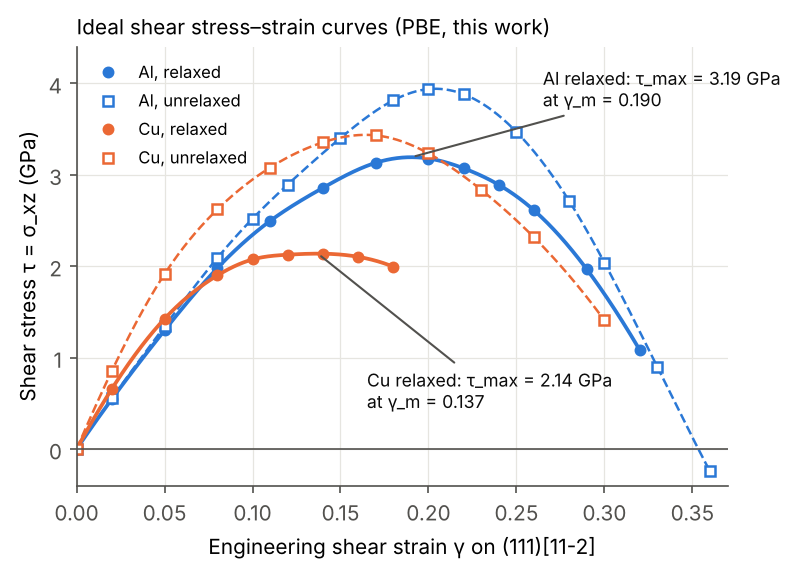
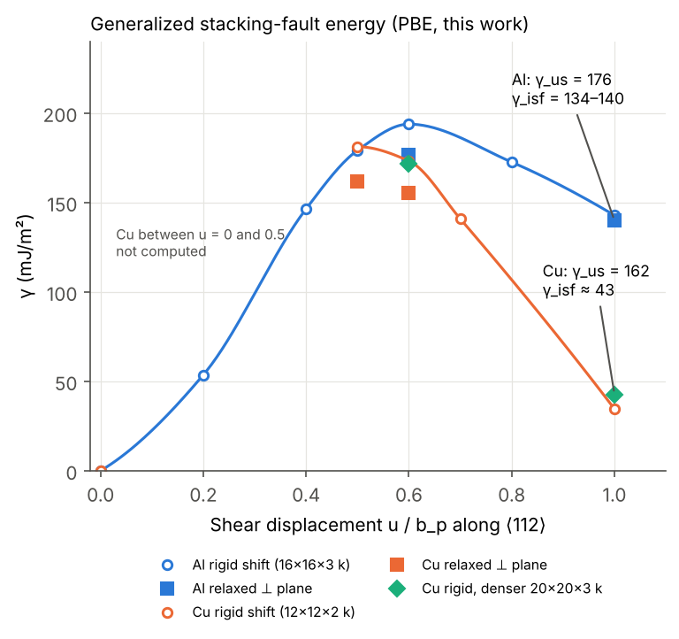

# 11 · Ideal shear strength of Al and Cu — reproducing *Ogata, Li & Yip, Science 298, 807 (2002)*

The ideal shear strength is the stress at which a perfect crystal becomes unstable to shear. It
is the upper bound on strength that nanoindentation, nanopillars and defect-free whiskers
approach, and the {111}<11-2> shear curve that produces it also gives the stacking-fault
energies that control dislocation dissociation and twinning. This project reproduces, with
Quantum ESPRESSO and PBE, the first-principles study of

> S. Ogata, J. Li, S. Yip, "Ideal Pure Shear Strength of Aluminum and Copper",
> *Science* **298**, 807–811 (2002). doi:10.1126/science.1076652

which found that Cu is stiffer than Al, yet Al has the higher ideal shear strength.

**Method.** A 1-atom fcc cell is sheared on (111) along the twinning sense of <11-2> with the
deformation gradient F = I + γ e_x e_zᵀ + D. In *affine* (unrelaxed) shear D = 0; in *pure*
(relaxed) shear the five other strain components in D are iterated until the five other stress
components vanish, so only τ = σ_xz acts. The ideal strength is τ_max = max over γ of τ(γ). The
linear-elastic limits are G_unrelaxed = (C11 − C12 + C44)/3 and
G_relaxed = 3C44(C11 − C12)/(C11 − C12 + 4C44).

## Results (this work, PBE)

| Quantity | This work (PBE, Quantum ESPRESSO) | Ogata et al. 2002 (GGA, VASP)\* |
|---|---|---|
| Al relaxed shear modulus G (GPa) | 27.3 | 25.4 |
| Al relaxed ideal shear strength tau_max (GPa) | **3.19** at gamma_m = 0.190 | 2.84 at 0.200 |
| Al unrelaxed (affine) tau_max (GPa) | 3.94 at 0.204 | – |
| Cu relaxed shear modulus G (GPa) | 32.9 | 31.0 |
| Cu relaxed ideal shear strength tau_max (GPa) | **2.14** at gamma_m = 0.137 | 2.65 at 0.137 |
| Cu unrelaxed (affine) tau_max (GPa) | 3.44 at 0.164 | – |
| Al unstable / intrinsic stacking-fault energy (mJ/m²) | 176 / 133–140 | 169 / – |
| Cu unstable / intrinsic stacking-fault energy (mJ/m²) | 162 / ≈43 | 158 / – |

\*Published values quoted from memory because the paper's PDF could not be downloaded in the environment
where this was produced — **check them against Table 1 of the paper before citing.**
Key qualitative result reproduced: Cu is stiffer than Al, yet Al has the higher ideal shear strength because
it sustains a much larger shear strain before softening.





## Layout

| Path | What it is |
|---|---|
| `qe.py` | Minimal helper: writes `pw.x` inputs, runs them, parses energy/stress/forces |
| `shear_geometry.py` | Shear frame (twinning sense), rotated stiffness, linear-elastic shear moduli |
| `01_cu_bulk.py` | Cu cutoff/k-point convergence, equation of state, elastic constants |
| `02_ideal_shear.py` | Affine (unrelaxed) and relaxed ("pure") {111}<11-2> shear of a 1-atom fcc cell |
| `03_sfe.py` | Stacking-fault energies: ANNNI model and tilted-cell GSFE |
| `05_cu_cprime_test.py`, `06_cu_paw_check.py` | Pseudopotential and k-point checks of the Cu elastic constants |
| `04_analysis.py` | Collects results, extracts τ_max / γ_m / G, makes the figures |
| `pseudo/` | Al (pslibrary US, generated with `ld1.x < Al.in`); Cu PAW (QE distribution, used for all Cu results); Cu US (rejected, kept for the comparison) |
| `results_*_from_creep_project.json` | Al stacking-fault results from [project 10](../10-dft-al-creep-parameters) |
| `runs/` | Every `pw.x` input and output file |
| `results_*.json`, `figures/` | Machine-readable results and figures |
| `tests/` | Unit tests (no `pw.x` needed) |

## How to run

```bash
conda activate dft                 # conda-forge: qe openmpi numpy scipy matplotlib
cd 11-ideal-shear-strength-ogata2002
./run_all.sh                       # reuses the committed outputs in runs/ (seconds)
./run_all.sh --fresh               # moves them to reference_results/ and recomputes (~8-10 h, 4 cores)
pytest tests                       # no pw.x needed
```

`run_all.sh` lists every step with its arguments; for example, the relaxed Al curve is
`DEG=0.04 python3 02_ideal_shear.py Al relaxed 24 0.02,0.05,...,0.32`. Every script skips
calculations whose output already contains `JOB DONE`, so an interrupted run continues where it
stopped. Most of the time goes into the Cu PAW calculations.

## Lessons learned
1. **Al needs dense k-sampling or wider smearing.** With 0.02 Ry smearing and a 24³ mesh, the
   Al shear stress at small strain was 38 % too low; 0.04 Ry Marzari–Vanderbilt smearing converges
   it at 24³ (checked against 32³ and 40³).
2. **Validate pseudopotentials on the property you need.** An ultrasoft Cu file gave a fine total
   energy but C11–C12 30 % too high; the PAW file reproduces experiment.
3. **Long cells need explicit `nbnd`.** (From project 10: the default number of bands silently
   corrupted the stacking-fault energies in a 12-layer cell.)

## Limitations

* The published values in the table are quoted from memory and still need checking against the paper.
* The Cu relaxed curve stops at γ = 0.18 and the Cu GSFE between u = 0 and 0.5 b_p was not
  computed, to save time; both are cheap to add with the same scripts.
* Phonon instabilities can cut the strength below the elastic τ_max (Clatterbuck et al. 2003);
  checking them needs phonon calculations along the shear path.

## References

* S. Ogata, J. Li & S. Yip, *Science* 298 (2002) 807 — the paper reproduced here.
* D. Roundy, C.R. Krenn, M.L. Cohen & J.W. Morris, *Phys. Rev. Lett.* 82 (1999) 2713 — ideal shear strengths of fcc Al and Cu (affine and relaxed shear).
* D.M. Clatterbuck, C.R. Krenn, M.L. Cohen & J.W. Morris, *Phys. Rev. Lett.* 91 (2003) 135501 — phonon instabilities and the ideal strength of Al.
* V. Vitek, *Philos. Mag.* 18 (1968) 773 — the generalized stacking-fault energy.
