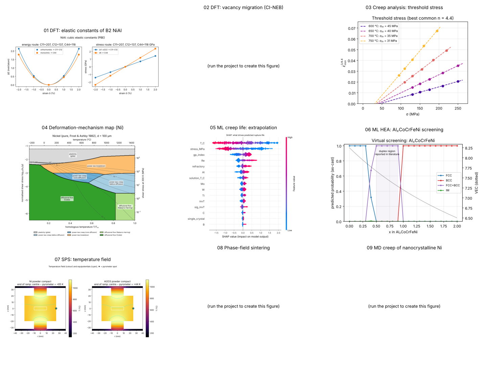

# Computational Materials Science for High-Temperature Structural Alloys

**DFT · machine learning · finite-volume, phase-field and molecular-dynamics simulation —
for creep, high-temperature deformation and sintering of alloys, intermetallics and
medium/high-entropy alloys.**

Shakti Kumar · PhD, Department of Materials Science & Engineering, IIT Kanpur

[](https://github.com/Shaktikr/mse-computational-projects/actions/workflows/tests.yml)
 

The eleven projects follow the research themes of the Mechanics and Materials Research
Laboratory at IIT Kanpur — creep and high-temperature deformation, spark plasma
sintering, B2 intermetallics, superalloys, medium/high-entropy alloys and ML for creep life
(see [docs/research-alignment.md](docs/research-alignment.md)). Every project is runnable,
unit-tested and documented, with the theory, the code and the results side by side.

---

## Projects

| # | Project | Methods | Highlights |
|---|---|---|---|
| 01 | [DFT fundamentals with Quantum ESPRESSO](01-dft-fundamentals-qe) | plane-wave DFT (PBE), ASE | convergence, EOS, elastic constants and formation enthalpy of Al, ferromagnetic Ni and **B2 NiAl** (C_ij within 5 % of experiment, ΔH_f = −0.66 eV/atom); annotated pw.x inputs; HPC template |
| 02 | [From vacancies to diffusional creep](02-dft-vacancy-diffusion-creep) | DFT supercells, constrained saddle / CI-NEB | vacancy formation + migration energies → D(T) → Nabarro–Herring / Coble creep vs grain size |
| 03 | [Creep data analysis toolkit](03-creep-data-analysis) | signal processing, regression | minimum creep rate, n, Q, **threshold stress**, θ-projection, Larson–Miller, Monkman–Grant, sinh law |
| 04 | [Deformation-mechanism maps](04-deformation-mechanism-maps) | constitutive modelling | Frost–Ashby maps (stress–temperature, stress–grain size) with test-point overlay |
| 05 | [ML for creep-rupture life](05-ml-creep-rupture-life) | GP, GBM, RF, MLP, SHAP, conformal | grouped CV, extrapolation, uncertainty, **inverse alloy design** |
| 06 | [ML for HEA phase & strength](06-ml-hea-phase-strength) | descriptors + RF/GBM/SVM | real MPEA dataset (1,545 entries): 80 % phase accuracy vs 58 % for empirical rules; Al_xCoCrFeNi screening |
| 07 | [SPS: Joule heating & densification](07-sps-joule-heating-densification) | finite-volume electro-thermal, kinetics | sample vs pyrometer temperature for metal/ceramic powders; n, Q, D_eff and master sintering curve from densification data |
| 08 | [Phase-field solid-state sintering](08-phase-field-sintering) | Cahn–Hilliard + Allen–Cahn, spectral | neck growth for surface vs grain-boundary diffusion, local growth exponent, pore pinch-off and rounding in a 16-particle aggregate |
| 09 | [MD creep of nanocrystalline metals](09-md-nanocrystalline-creep) | LAMMPS, EAM | Voronoi polycrystals (fcc / B2), constant-stress creep with seed averaging, stress exponent and activation energy |
| 10 | [First-principles creep parameters of Al](10-dft-al-creep-parameters) | Quantum ESPRESSO (PBE), plain pw.x inputs | G, b, vacancy E_f and E_m, GSFE → **Q = 1.26 eV vs 1.28 eV measured**, γ_isf = 134–140 mJ/m²; D(T) and creep rates; all runs committed |
| 11 | [Ideal shear strength of Al and Cu (Ogata, Li & Yip, *Science* 2002)](11-ideal-shear-strength-ogata2002) | DFT stress–strain, relaxed (pure) shear, GSFE | reproduces the paper's finding that Al is stronger in ideal shear than the stiffer Cu (τ_max 3.19 vs 2.14 GPa) |



## Quick start

```bash
git clone https://github.com/Shaktikr/mse-computational-projects.git
cd mse-computational-projects
conda env create -f environment.yml && conda activate msecomp   # or: pip install -r requirements.txt
pytest                                                          # ~60 tests, under a minute
python 03-creep-data-analysis/scripts/analyze_creep.py 03-creep-data-analysis/data/synthetic_composite
```

Full instructions (Quantum ESPRESSO on Ubuntu/WSL, LAMMPS, cluster runs, using your own
data): [docs/getting-started.md](docs/getting-started.md).

## Learning DFT

New to DFT? [docs/dft-learning-roadmap.md](docs/dft-learning-roadmap.md) is a 16-week path
from the Kohn–Sham equations to defects, phonons, SQS alloys and machine-learned
potentials, built around projects 01 and 02; projects 10 and 11 are complete worked examples
(a full parameter study, and the reproduction of a published paper).

## Repository layout

```
├── 01-dft-fundamentals-qe/        dftlab/ (package)  scripts/  inputs/  pseudo/  hpc/  results/
├── 02-dft-vacancy-diffusion-creep/ vacdiff/  scripts/  results/
├── 03-creep-data-analysis/        creepkit/  scripts/  data/  results/
├── 04-deformation-mechanism-maps/ defmap/  materials/  scripts/  results/
├── 05-ml-creep-rupture-life/      creepml/  scripts/  data/  results/
├── 06-ml-hea-phase-strength/      heaml/  scripts/  data/ (MPEA dataset)  results/
├── 07-sps-joule-heating-densification/ spsmodel/  scripts/  results/
├── 08-phase-field-sintering/      pfsinter/  scripts/  results/
├── 09-md-nanocrystalline-creep/   mdcreep/  scripts/  lammps_inputs/  potentials/  results/
├── 10-dft-al-creep-parameters/    numbered pw.x workflow scripts  pseudo/  runs/ (all inputs + outputs)  tests/
├── 11-ideal-shear-strength-ogata2002/ shear scripts  pseudo/  runs/  figures/  tests/
└── docs/                          roadmap, research alignment, getting started
```

Each project has its own README (theory → how to run → results → limitations → references)
and a `tests/` folder; `results/` holds the figures and JSON summaries produced by the
scripts in this repository.

## A note on data

* **Real data:** the MPEA dataset (project 06) and all DFT/MD/simulation outputs, which are
  computed by the code here.
* **Synthetic data, clearly labelled:** creep curves (project 03), the superalloy
  creep-rupture database (project 05) and SPS densification curves (project 07B) are
  generated from known physical models so that every analysis method can be validated
  against the ground truth. Replace them with laboratory data using the documented
  formats — the pipelines are written for that.

## Citing / licence

Code: MIT licence. Third-party data and potentials keep their own licences (see
[LICENSE](LICENSE)). If this repository helps your work, please cite the original methods
papers listed in each project README.
